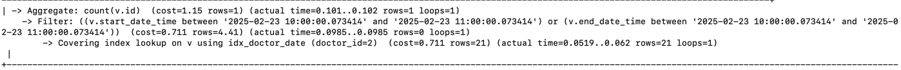
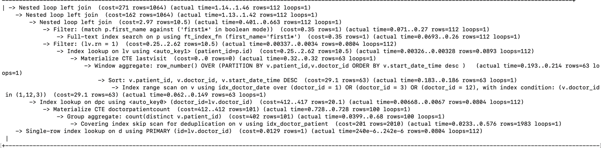
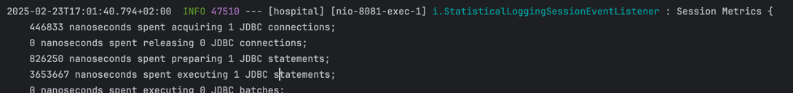

Вирішення оптимизаційних проблем, для аналізу деяких проблем використовувавсь статистика згенерована Hibernate та аналіз плану виконання запитів:

1. Connection Pool розміром 20 конекшенів
2. N+1: в ентіті не має зайвих двосторонніх зав’язків, використовується FetchType Lazy. Запити використовують JOINи або
   FETCH JOINи
3. Індекси створювались на колонки, по яким найчастіше відбувається пошук, а саме на такі колонки:

* На первинні, вторинні ключі створюються по дефолту
* full text index для firstName на patients для швидкого пошуку у комбінації з MATCH, AGAINST у запиті для знаходження
  пацієнтів та їх візитів до лікарів
* композит індекс (doctor_id, start_date_time, end_date_time) на visits використовується у двох запитах:
    - **запит 1** для підрахунку кількості конфліктів при стоврення новго візиту 
      _Covering
      index_ означає, що запит може бути повністю «витягнутий» з індексу.
    - **запит 2** для знаходження пацієнтів та їх візитів до лікарів за вказанмим
      параметрами 
      _Covering index skip scan for deduplication_ означає, що запит може бути повністю «витягнутий» з індексу та
      використання стркутури індексу для оптимального підрахунку унікальних значень.

4. Під час аналізу логів після виконання GET request було знайдено велику кількість непотрібних реквестів до бази даних
   та скороченого кількість запитів до БД до 1 запиту.
   Було оптимізовано логіку та отримано наступні позитивні результати:

   |                                | **Без оптимізації** | **З оптимізацією** | **Різниця**      |
   |--------------------------------|---------------------|--------------------|------------------|
   | **Кількість JDBC стейтментів** | 22                  | 1                  | 5.5 times less   |
   | **Preparing JDBC стейтменти**  | 1738167 ns          | 826250 ns          | 2.1 times faster |
   | **Executing JDBC стейтменти**  | 13298455 ns         | 3653667 ns         | 3.6 times faster |

  
