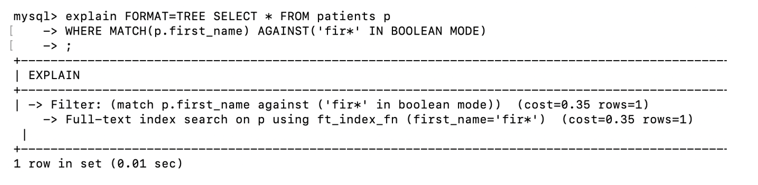
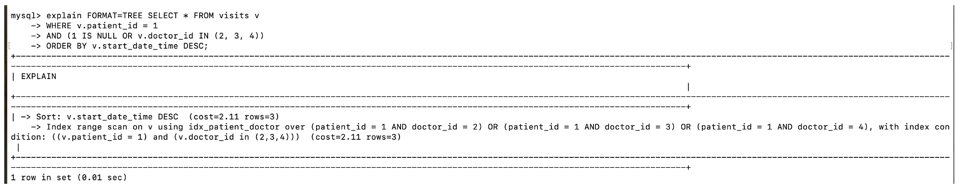
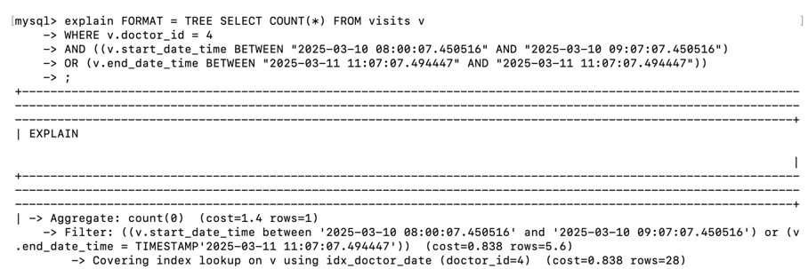
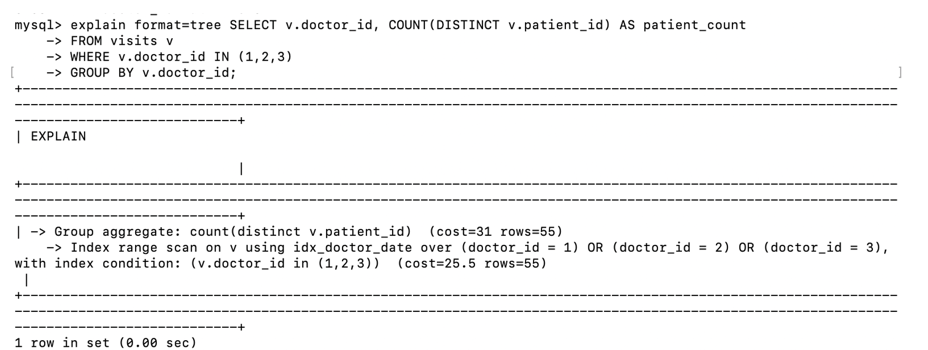
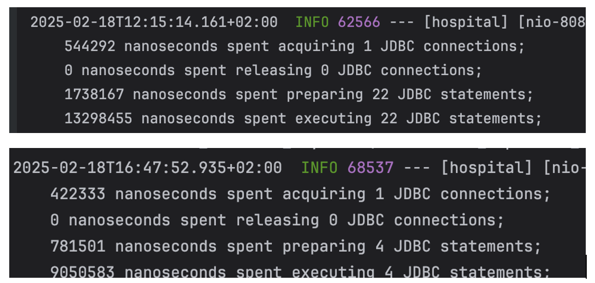

Вирішення оптимизаційних проблем, для аналізу деяких проблем використовувавсь статистика згенерована Hibernate:

1. Connection Pool розміром 20 конекшенів
2. N+1: в ентіті не має зайвих двосторонніх зав’язків, використовується FetchType Lazy. Запити використовують JOINи або
   FETCH JOINи
3. Індекси створювались на колонки, по яким найчастіше відбувається пошук, а саме на такі колонки:

* На первинні ключі створюються по дефолту
* full text index для firstName на patients для швидкого пошуку у комбінації з MATCH, AGAINST у запиті
  
* композит індекс (patient_id, doctor_id, start_date_time) на visits використовується у наступому запиті
  
* композит індекс (doctor_id, start_date_time, end_date_time) на visits використовується у наступих запитах. Covering
  Index означає, що запит може бути повністю «витягнутий» з індексу, що скорочує читання з диска.
  
  

4. Під час аналізу логів після виконання GET request було знайдено велику кількість непотрібних реквестів до бази даних.
   Було оптимізовано логіку та отримано наступні позитивні результати:
 
   |                                | **Без оптимізації** | **З оптимізацією**  | **Різниця**             |
   |--------------------------------|---------------------|---------------------|-------------------------|
   | **Кількість JDBC стейтментів** | 22                  | 4                   | 5.5 times less          |
   | **Preparing JDBC стейтменти**  | 1738167 ns          | 781501 ns           | 2.22 times faster       |
   | **Executing JDBC стейтменти**  | 13298455 ns         | 9050583 ns          | 1.47 times faster       |

   